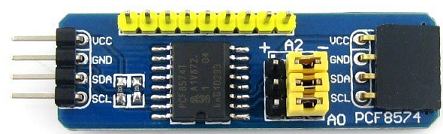
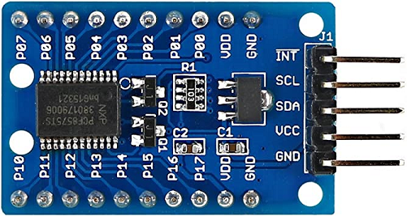
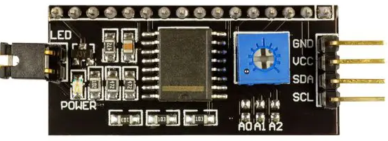
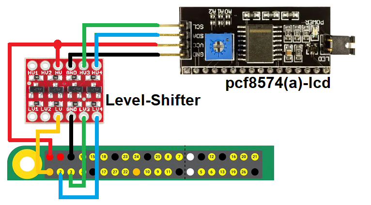

# node-red-contrib-iiot-rpi-gpio

[](https://nodered.org)
[](https://www.raspberrypi.com/)


[](https://www.paypal.com/cgi-bin/webscr?cmd=_s-xclick&hosted_button_id=ZDRCZBQFWV3A6)

A Node-Red node for pcf8574(A), pcf8575, pcf8574(A) + hd44780-LCD<br>

### **Example pcf8574 module**


### **Example pcf8575 module**


### **Example pcf8574-lcd module**


## Installation
Install with Node-Red Palette Manager or npm command:
```
cd ~/.node-red
npm install node-red-contrib-iiot-rpi-pcf857x
```
## Nodes
- **pcf857x-in**: Reads from pcf857x.
- **pcf857x-out**: Writes to pcf857x.
- **hd44780**: Controls LCD-Display (hd44780) with pcf8574(a).

## Usage
- This node works on Raspberry Pi with 32bit or 64bit OS.
- LCD needs 5V for operate
- Enable I2C with raspi-config.
- LCD needs 5V for operate.

### **Connecting pcf8574(a) module with level-shifter**


[CHANGELOG](CHANGELOG.md)<br>